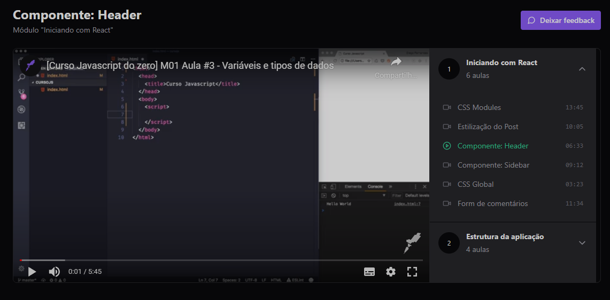

<h1>Play vídeo usando Zustand</h1>

Projeto aula pela Rocketseat trilha ignite construido no curso de Redux + Zustand.
Aprendemos a fazer uso do Redux primeiramente, depois migramos para outro gerecenciamento de estado o Zustand que é baseado no Redux porém é mais fácil de trabalhar.

Realizamos pequenos testes unitários e em breve por conta prória irei realizar a construção da api Play video

<h2>Principais Tecnologias</h2>

- react
- zustand
- typescript
- tailwindcss
- react-player
- vite

<h2 align='center'> Meus contatos </h2>

>Se tiver alguma dúvida, sugestão ou feedback, sinta-se à vontade para entrar em contato:

* [LinkedIn](https://www.linkedin.com/in/romeu-soares-87749a231/)

* romeuindexjs@gmail.com

* WhatsApp: 84 981127596